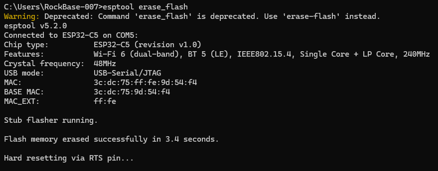
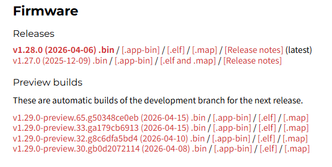
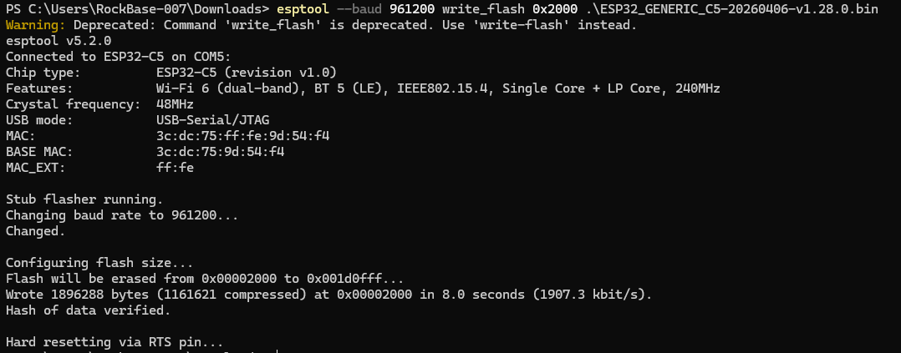
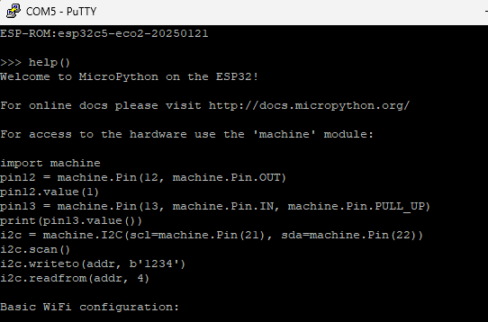
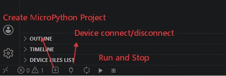

# Using MicroPython with NM-CYD-C5

## Hardware Preparation

Before you start, you need to prepare a NM-CYD-C5 board.

## Deploying MicroPython Firmware

Next, we will guide you through how to deploy the MicroPython firmware on the NM-CYD-C5.

### Install esptool

First, you need to install esptool first. If you installed the python3, open a terminal and enter the following command.

`pip install esptool`

Second, before installing MicroPython on the NM-CYD-C5, use the following command to erase the Flash first.

`esptool erase_flash`



### Flashing

Step1. Get micropython firmware from [MicroPython ESP32_GENERIC_C5](https://micropython.org/download/ESP32_GENERIC_C5/)

We can choose the Release version `ESP32_GENERIC_C5-20260406-v1.28.0.bin`



Step2. deploy the firmware to NM-CYD-C5, **Notice, the starting address of ESP32 C5 is 0x2000.** 

`esptool --baud 961200 write_flash 0x2000 .\ESP32_GENERIC_C5-20260406-v1.28.0.bin`



After deploy ESP32-C5 firmware, you can connect the Board with COMx, default baudrate 115200, you can see work with putty below.



## Develop MicroPython

You can choose to Install [Thonny IDE](https://thonny.org/) or **RT-Thread MicroPython** on Visual Studio Code.

### Wi-Fi Connection Example
```python
import network
import time

def connect_wifi(ssid, password, timeout=10):
    wlan = network.WLAN(network.STA_IF)

    # If already connected, return immediately
    if wlan.isconnected():
        print("Already connected.")
        print("Network config:", wlan.ifconfig())
        return True

    # Enable the Wi-Fi interface
    wlan.active(True)

    # FIX: If a previous connection attempt is still in progress,
    # disconnect first to reset the internal state. Otherwise
    # wlan.connect() will raise "sta is connecting, cannot set config".
    try:
        wlan.disconnect()
        time.sleep(0.5)
    except OSError:
        # disconnect() may error if no connection was pending; safe to ignore
        pass

    print(f"Connecting to network: {ssid} ...")
    wlan.connect(ssid, password)

    # Wait for connection with a timeout
    max_wait = timeout
    while max_wait > 0:
        if wlan.isconnected():
            break
        max_wait -= 1
        print("Waiting for connection...")
        time.sleep(1)

    if wlan.isconnected():
        print("Connected successfully!")
        print("Network config (IP/Mask/Gateway/DNS):", wlan.ifconfig())
        return True
    else:
        print("Connection failed. Please check SSID or password.")
        return False


# ==========================================
# Main Program
# ==========================================

SSID = "YourWiFiName"
PASSWORD = "YourWiFiPassword"

def main():
    print("Welcome to RT-Thread MicroPython!")
    connect_wifi(SSID, PASSWORD)

if __name__ == '__main__':
    main()

```

With RT-Thread MicroPython Visual Studio Code, create a MicroPython project and `wifi_connect.py.`




### ST7789 Screen Demos

You can see many Screen demo from [MicroPython LCD Driver in Python](https://github.com/RockBase-iot/st7789py_mpy), which supports many boards.

To run with NM-CYD-C5, you can get `tft_config.py` from `tft_configs/nm-cyd-c5`.

Before run the `rotations.py` example, 

1. Device connect the nm-cyd-c5 with COMx;
2. Then you should **Sync** the files to nm-cyd-c5 board, or you may get Error "Can't find xxx".
3. Run the example.  


## Reference

1. [ESP32-C5 Installation instructions](https://micropython.org/download/ESP32_GENERIC_C5/)

2. [MicroPython LCD Driver in Python](https://github.com/russhughes/st7789py_mpy)